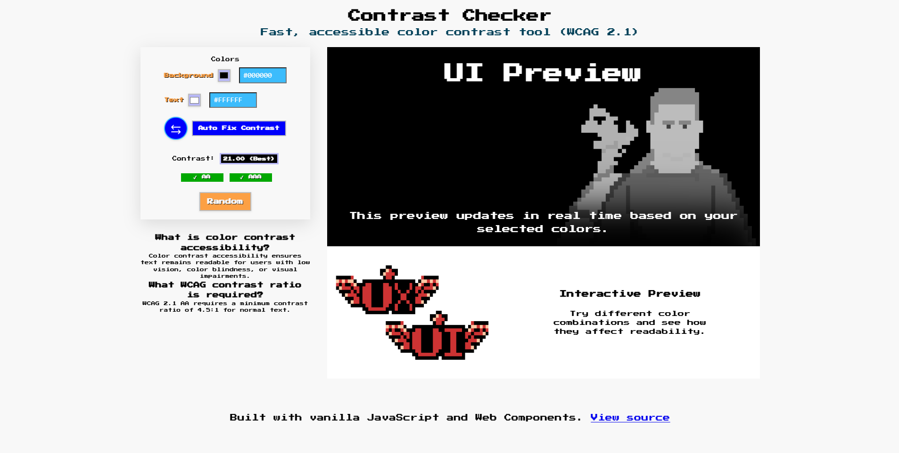

# ContrAst: The Color Wars – NES-Inspired Accessibility Color Checker



A retro-inspired accessibility tool built with vanilla JavaScript and Web Components that helps developers and designers create WCAG-compliant color combinations.

ContrAst combines old-school NES aesthetics with modern frontend architecture and accessibility-first engineering practices. The project provides real-time color contrast validation, automatic text contrast correction, live UI previews, and responsive accessible design patterns.

---

# 🎮 Overview

ContrAst: The Color Wars is a browser-based color contrast checker inspired by classic NES-era UI and arcade aesthetics.

The application allows users to:

- Test background and text color combinations
- Validate WCAG 2.1 accessibility compliance
- Automatically correct inaccessible text contrast
- Preview colors applied to sample UI components in real time
- Explore randomized accessible color palettes

The project was intentionally built without frameworks to demonstrate strong fundamentals in:

- Semantic HTML
- Modern CSS architecture
- ES Modules
- Web Components
- Accessibility engineering
- State-driven UI updates
- Modular frontend architecture

---

# ✨ Features

- 🎨 Live color contrast checking
- ♿ WCAG 2.1 AA / AAA compliance validation
- ⚡ Real-time UI preview updates
- 🔄 Swap foreground/background colors
- 🎲 Random accessible color generation
- 🛠️ Auto-fix text contrast algorithm
- 🧱 Modular utility architecture
- 📱 Mobile-first responsive design
- 🕹️ Retro NES-inspired visual theme
- 💾 Persistent color state with localStorage
- 🚀 Zero-framework frontend implementation

---

# ♿ Accessibility Features

ContrAst was designed with accessibility as a core engineering requirement rather than an afterthought.

Accessibility improvements include:

- Semantic HTML structure
- Proper heading hierarchy
- ARIA labels for controls and regions
- Keyboard-accessible interactions
- Focus-visible interactive states
- Skip-to-content navigation
- WCAG-compliant contrast calculations
- Live contrast feedback
- Responsive typography and layout
- Accessible color auto-correction logic
- Descriptive image alt text
- Mobile-friendly touch targets

The project follows WCAG 2.1 contrast standards:

- AA compliance: 4.5:1 minimum contrast ratio
- AAA compliance: 7:1 minimum contrast ratio

---

# 🛠️ Tech Stack

## Core Technologies

- HTML5
- CSS3
- Vanilla JavaScript (ES Modules)

## Architecture Patterns

- Web Components
- Component-based CSS organization
- Utility-driven modular architecture
- Event-driven state updates
- CSS custom properties (variables)

## Browser APIs

- Custom Events
- localStorage
- CSS Variables
- Custom Elements API

---

# 🧱 Architecture

The project follows a modular frontend architecture with clear separation of concerns.

## Design Principles

- Single responsibility utilities
- Stateless rendering layer
- Component-driven UI structure
- Decoupled state management
- Centralized accessibility logic
- Reusable utility modules

## Utility Responsibilities

### `color-utils.js`

Handles low-level color operations:

- HEX validation
- RGB conversion
- Random color generation

### `contrast-utils.js`

Handles accessibility calculations:

- Luminance calculation
- Contrast ratio computation
- WCAG status evaluation
- Accessible pair generation
- Automatic text contrast correction

### `storage-utils.js`

Handles persistence:

- Save color preferences
- Restore saved application state

---

# 📁 Project Structure

```txt
/assets

/components
  /blog-card
    blog-card.css
    blog-card.js

  /color-checker
    color-checker.css
    color-checker.js

  /masthead-component
    masthead-component.css
    masthead-component.js

/styles
  /global
    global.css

  fonts.css
  vars.css

/utils
  color-utils.js
  contrast-utils.js
  storage-utils.js

index.html
main.css
main.js
README.md
```

---

# 💻 Local Development

## Clone the repository

```bash
git clone https://github.com/Jorchava/fuzzy-waddle.git
```

## Navigate into the project

```bash
cd fuzzy-waddle
```

## Run locally

Because the project uses ES Modules, run it through a local development server.

### VSCode Live Server

Install:

- Live Server extension

Then:

- Right click `index.html`
- Select `Open with Live Server`

### Python HTTP Server

```bash
python -m http.server 5500
```

Then open:

```txt
http://localhost:5500
```

---

# 🚀 Deployment

ContrAst can be deployed easily to modern static hosting providers.

## Deployment Notes

- No backend required
- No build step required
- Fully static frontend application
- Optimized for CDN delivery

---

# 🔮 Future Improvements

Planned improvements and experimental ideas:

- 🎯 Small vs large text WCAG analysis
- 🎨 Suggested accessible alternative palettes
- 🌗 Light/dark UI themes
- 📋 Copy-to-clipboard HEX actions
- 📈 Contrast history tracking
- 🧪 Unit testing for utility modules
- 🖼️ Export/share generated palettes
- 📊 Accessibility score visualization

---

# 👾 Credits

## Inspiration

- NES-era UI and visual design
- Contra (Konami, 1988)
- Retro arcade aesthetics
- Accessibility-first frontend engineering

## Accessibility Resources

- [WCAG 2.1 Guidelines](https://www.w3.org/WAI/standards-guidelines/wcag/)
- [WebAIM Contrast Checker](https://webaim.org/resources/contrastchecker/)
- [MDN Accessibility Docs](https://developer.mozilla.org/en-US/docs/Web/Accessibility)

## Built With

- Vanilla JavaScript
- Web Components
- CSS Variables
- Semantic HTML

---

# 🕹️ Ready to CONTRAST?

```txt
↑ ↑ ↓ ↓ ← → ← → B A
```

Fight inaccessible UI one color combination at a time.
